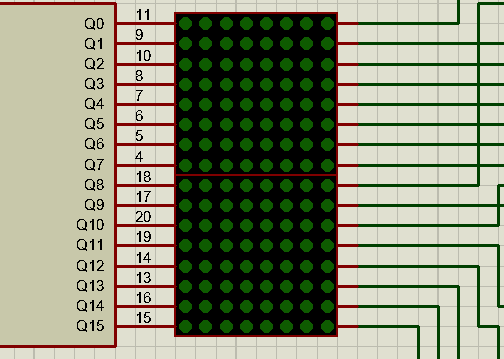

# Description
Tetris implementation written in C for PIC18F4550, can be compiled
with XC8 compiler of Microchip. Schematics for assembling and
simulation are provided for Proteus SPICE Software (v8.6).

# Author
Manoel Vilela
